# Social Dining App

You have time on your hands, but zero plans. Whether alone or with company, attempting to figure out what to do with your day is almost as difficult as trying to decide on what to eat. 

The Random Activity Generator helps try to make it less difficult and fun. With simplicity in mind, you have two options available, choose a specific category and limit the results to "Accessible" activities. With the activity follows YouTube videos related to the activity generated.  

## Screenshots
Landing Page:
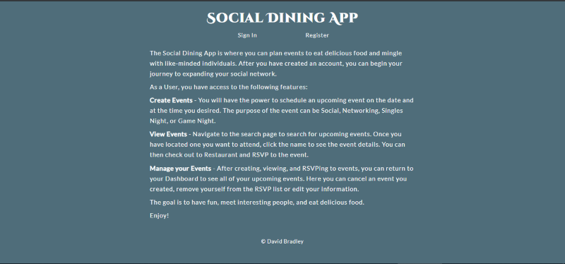

Register:
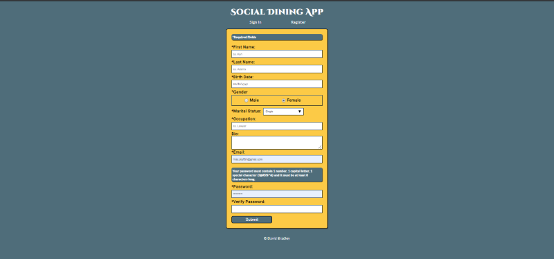

Account Created:
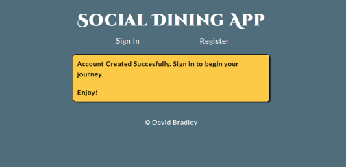

Sign In:
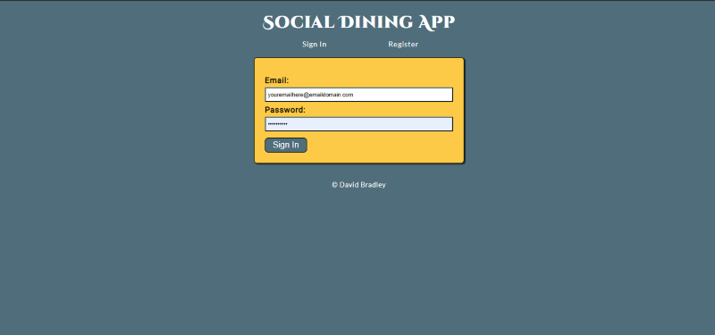

Dashboard:
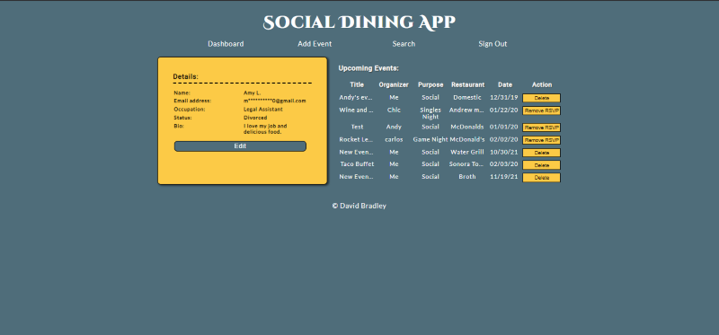

Edit User Details:
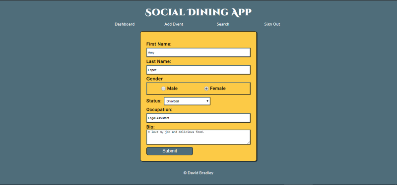

Edit Event Details:
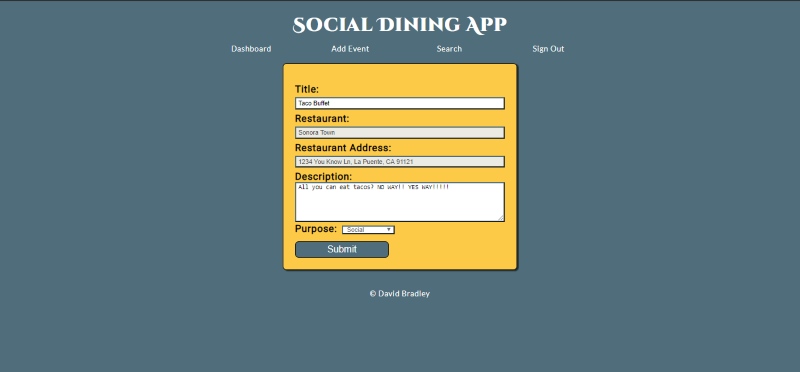

Add Event:
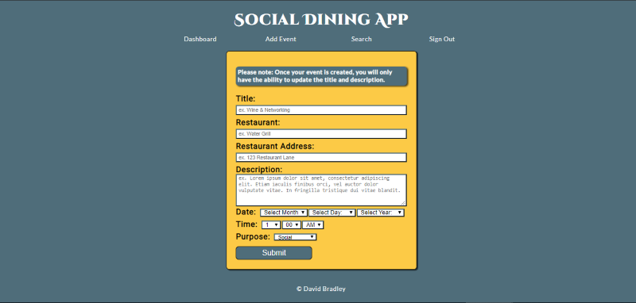

Search:
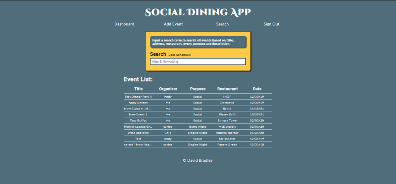

Event Details:
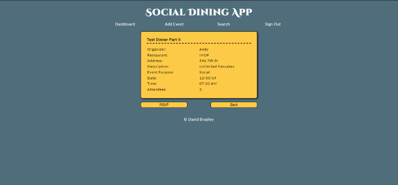

Event Organizer Details:
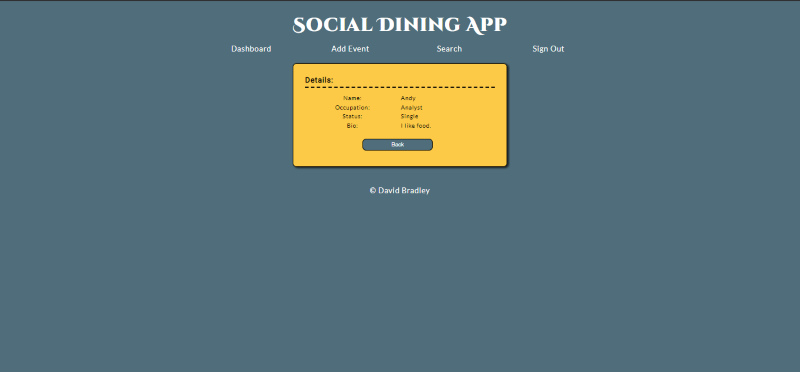

Logged Out:  
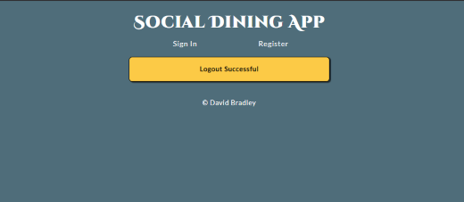

Error:
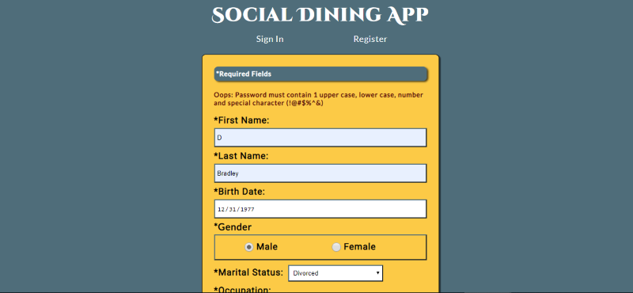

## Built with
* HTML5
* CSS3
* JavaScript/ES6
* ReactJS
* [RESTful API](https://github.com/djbradleyii/social-dining-app-api)

### Features:
- Responsive Design
- Accessible Design
- Register for an account
- Secure Signin
- User Dashboard
  - Edit User Details
  - View all upcoming events you created or plan to attend
- Add an Event
- Search All Events
	- Case Sensitive Keyword Search
	- Click Title to view event details
	- Click Organizer to view organizer information

## Demo

- [Live Demo](https://social-dining-app.now.sh/)
